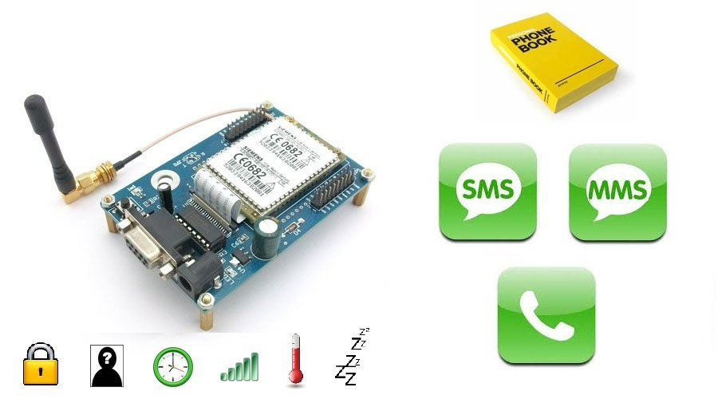

# GSM TC35 Python library
[](https://github.com/QuentinCG/GSM-TC35-Python-Library/blob/master/LICENSE.md) [](https://paypal.me/QuentinCG)

## What is it

This python library is designed to be integrated in python or shell projects using TC35 module.
It is multi-platform and compatible with python 3+.

Most functionalities should work with other GSM module using AT commands.



## Functionalities

Non-exhaustive list of GSMTC35 class functionalities:
  - Check/Enter PIN/PUK
  - Lock/Unlock/Change PIN
  - Send/Receive/Delete SMS/MMS
  - Call/Re-call (possible to hide phone number)
  - Hang-up/Pick-up call
  - Enable/disable/check Call/SMS/Fax forwarding
  - Get/Add/Delete phonebook entries (phone numbers + contact names)
  - Sleep with wake up possibilities (Low power consumption)
  - Check if someone is calling
  - Check if there is a call in progress
  - Check call status (call/ringing/...) and get the associated phone number
  - Get last call duration
  - Check if module is alive
  - Switch off
  - Reboot
  - Check sleep mode status
  - Get IDs (manufacturer, model, revision, IMEI, IMSI)
  - Set module to manufacturer state
  - Get the current used operator
  - Get the signal strength (in dBm)
  - Set and get the date from the module internal clock
  - Get list of operators
  - Get list of neighbour cells
  - Get accumulated call meter and accumulated call meter max (in home units)
  - Get temperature status
  - Change the baudrate mode

Non-exhaustive list of shell commands:
  - Send/Receive/Delete SMS/MMS
  - Call
  - Hang-up/Pick-up call
  - Show information (PIN status, operator, signal strength, last call duration, manufacturer/model/revision ID, IMEI, IMSI, date from internal clock, call status and associated phone number, operator list, neighbour cells, accumulated call meter (max), temperature status, sleep mode status)

## How to install (python script and shell)

  - Install package calling `python setup.py install` from the root of this repository
  - Connect your GSM module to a serial port
  - Get the port name (you can find it out by calling `python GSMTC35/GSMTC35.py --help` from the root of this repository)
  - Load your shell or python script

## How to use in shell

```shell
# Get help
python GSMTC35.py --help

# Send SMS or MMS (if > 140 normal char or > 70 unicode char)
python GSMTC35.py --serialPort COM4 --pin 1234 --sendSMS +33601234567 "Hello from shell! 你好，你是？"

# Send SMS/MMS (encoded, in hexadecimal / UTF-8)
python GSMTC35.py --serialPort COM4 --pin 1234 --sendEncodedSMS +33601234567 48656C6C6F2066726F6D207368656C6C2120E4BDA0E5A5BDEFBC8CE4BDA0E698AFEFBC9F

# Send (multiple) SMS (encoded by TC35 using 'Text Mode', NOT RECOMMENDED)
python GSMTC35.py --serialPort COM4 --pin 1234 --sendTextModeSMS +33601234567 "Hello from shell!"

# Get SMS/MMS (decoded, in plain text)
python GSMTC35.py --serialPort COM4 --pin 1234 --getSMS "ALL"

# Get SMS/MMS (encoded, in hexadecimal, charset specified in response)
python GSMTC35.py --serialPort COM4 --pin 1234 --getEncodedSMS "ALL"

# Get SMS (decoded by TC35 using 'Text Mode', NOT RECOMMENDED)
python GSMTC35.py --serialPort COM4 --pin 1234 --getTextModeSMS "ALL"

# Delete SMS
python GSMTC35.py --serialPort COM4 --pin 1234 --deleteSMS "ALL"

# Call
python GSMTC35.py --serialPort COM4 --pin 1234 --call +33601234567

# Call in hidden mode
python GSMTC35.py --serialPort COM4 --pin 1234 --call +33601234567 True

# Hang up call
python GSMTC35.py --serialPort COM4 --pin 1234 --hangUpCall

# Pick up call
python GSMTC35.py --serialPort COM4 --pin 1234 --pickUpCall

# Show GSM module and network information
python GSMTC35.py --serialPort COM4 --pin 1234 --information

# Use "--debug" to show more information during command
# Use "--nodebug" to not show any warning information during command
```

## How to use in python script

Example of python script using this library:

```python
import sys
from GSMTC35 import GSMTC35

gsm = GSMTC35()
pin = "1234"
puk = "12345678"
pin2 = "4321"
puk2 = "87654321"

# Mandatory step (PIN/PUK/PIN2/PUK2 will be entered if required, not needed to specify them)
if not gsm.setup(_port="COM3", _pin=pin, _puk=puk, _pin2=pin2, _puk2=puk2):
  print("Setup error")
  sys.exit(2)

if not gsm.isAlive():
  print("The GSM module is not responding...")
  sys.exit(2)

# Send SMS or MMS (if > 140 normal char or > 70 unicode char)
print("SMS sent: "+str(gsm.sendSMS("+33601234567", u'Hello from python script!!! 你好，你是？')))

# Send (multiple) SMS (encoded by TC35 using 'Text Mode', NOT RECOMMENDED)
print("SMS Text Mode sent: "+str(gsm.sendSMS("+33601234567", 'Hello from python script!!!', True)))

# Show all received SMS/MMS (decoded)
rx_sms = gsm.getSMS(GSMTC35.eSMS.ALL_SMS)
print("List of SMS (decoded):")
for sms in rx_sms:
  print(str(sms["phone_number"])+" (id " +str(sms["index"])+", "
        +str(sms["status"])+", "+str(sms["date"])+" "+str(sms["time"])
        +"): "+str(sms["sms"]))

# Show all received SMS/MMS (encoded)
rx_encoded_sms = gsm.getSMS(GSMTC35.eSMS.ALL_SMS, False)
print("List of SMS (encoded):")
for sms in rx_encoded_sms:
  print(str(sms["phone_number"])+" (id " +str(sms["index"])+", "
        +str(sms["status"])+", "+str(sms["charset"])+", "
        +str(sms["date"])+" "+str(sms["time"])+"): "+str(sms["sms"]))

# Show all received SMS (using text mode, NOT RECOMMENDED)
rx_text_mode_sms = gsm.getSMS(GSMTC35.eSMS.ALL_SMS, False, True)
print("List of SMS (using text mode, NOT RECOMMENDED):")
for sms in rx_text_mode_sms:
  print(str(sms["phone_number"])+" (id " +str(sms["index"])+", "
        +str(sms["status"])+", "+str(sms["date"])+" "+str(sms["time"])
        +"): "+str(sms["sms"]))

# Delete all received SMS
print("Delete all SMS: "+str(gsm.deleteSMS(GSMTC35.eSMS.ALL_SMS)))

# Call
print("Called: "+str(gsm.call(phone_number="0601234567", hide_phone_number=False)))

# Re-call same number
print("Re-called: "+str(gsm.reCall()))

# Last call duration
print("Last call duration: "+str(gsm.getLastCallDuration())+"sec")

# Pick up call
print("Picked up: "+str(gsm.pickUpCall()))

# Hang up call
print("Hanged up: "+str(gsm.hangUpCall()))

# Check Call/SMS/Fax/Data forwarding
print("Call/SMS/Fax/Data forwarding status: "+str(gsm.getForwardStatus()))

# Enable/disable Call/SMS/Fax/Data forwarding
print("Enable call forwarding: "+str(gsm.setForwardStatus(GSMTC35.eForwardReason.UNCONDITIONAL, GSMTC35.eForwardClass.VOICE, True, "+33601020304")))
print("Disable call forwarding: "+str(gsm.setForwardStatus(GSMTC35.eForwardReason.UNCONDITIONAL, GSMTC35.eForwardClass.VOICE, False)))

# Add entry in GSM module phonebook
print("Added contact to GSM module phonebook: "
      +str(gsm.addEntryToPhonebook("0600000000", "Dummy contact",
                                   GSMTC35.ePhonebookType.GSM_MODULE)))

# Get entry list in GSM module phonebook:
entries = gsm.getPhonebookEntries(GSMTC35.ePhonebookType.GSM_MODULE)
print("List of stored contacts:")
for entry in entries:
  print(str(entry['index']+": "+str(entry['contact_name'])+" -> "+str(entry['phone_number'])))

# Delete all GSM phonebook entries:
print("Deleted all contact from GSM module phonebook: "
      +str(gsm.agsm.deleteAllEntriesFromPhonebook(GSMTC35.ePhonebookType.GSM_MODULE)))

# Check if someone is calling
print("Incoming call: "+str(gsm.isSomeoneCalling()))

# Check if there is a call in progress
print("Call in progress: "+str(gsm.isCallInProgress()))

# Check if someone is calling, if a call is in progress, dialing and the associated phone number
call_state, phone_number = gsm.getCurrentCallState()
print("Call status: "+str(call_state)+" (associated phone number: "+str(phone_number)+")")
print("(-1=No call, 0=Call active, 1=Held, 2=Dialing, 3=Alerting, 4=Incoming, 5=Waiting)")

# Edit SIM Pin
print("SIM Locked: "+str(gsm.lockSimPin(pin)))
print("SIM Unlocked: "+str(gsm.unlockSimPin(pin)))
new_pin = pin # (Just for test)
print("SIM Pin changed: "+str(gsm.changePin(pin, new_pin)))

# Set module clock to current date
print("Clock set: "+gsm.setInternalClockToCurrentDate())

# Show additional information
print("GSM module Manufacturer ID: "+str(gsm.getManufacturerId()))
print("GSM module Model ID: "+str(gsm.getModelId()))
print("GSM module Revision ID: "+str(gsm.getRevisionId()))
print("Product serial number ID (IMEI): "+str(gsm.getIMEI()))
print("International Mobile Subscriber Identity (IMSI): "+str(gsm.getIMSI()))
print("Current operator: "+str(gsm.getOperatorName()))
sig_strength = gsm.getSignalStrength()
if sig_strength != -1:
  print("Signal strength: "+str(sig_strength)+"dBm")
else:
  print("Signal strength: Wrong value")
print("Date from internal clock: "+str(gsm.getDateFromInternalClock()))
print("List of operators: "+str(gsm.getOperatorNames()))
print("Neighbour cells: "+str(gsm.getNeighbourCells()))
print("Accumulated call meter: "+str(gsm.getAccumulatedCallMeter())+" home units")
print("Accumulated call meter max: "+str(gsm.getAccumulatedCallMeterMaximum())+" home units")
print("Is temperature critical: "+str(gsm.isTemperatureCritical()))
print("Is in sleep mode: "+str(gsm.isInSleepMode()))

# Make the GSM module sleep for 20sec (may be wake up by received call or SMS)
sleep_ok, timer_wake, call_wake, sms_wake, temp_wake = \
  gsm.sleep(wake_up_with_timer_in_sec=20, wake_up_with_call=True,
            wake_up_with_sms=True)
print("GSM was in sleep mode ("+str(sleep_ok)+"), wake-up by: Timer ("
      +str(timer_wake)+") or a call ("+str(call_wake)+") or a SMS ("+str(sms_wake)+")")

# Reboot (an init is needed to use gsm functions after such a call)
print("Reboot: "+str(gsm.reboot()))

# Switch off device (gsm will not respond after such a call)
print("Switched off: "+str(gsm.switchOff()))

# At the end, close connection with GSM module
gsm.close()
```

## Examples

List of examples:
  - <a target="_blank" href="https://github.com/QuentinCG/GSM-TC35-Python-Library/tree/master/examples/rest_api/README.md">Expose GSM module to REST-API</a>

## License

This project is under MIT license. This means you can use it as you want (just don't delete the library header).

## Contribute

If you want to add more examples or improve the library, just create a pull request with proper commit message and right wrapping.
